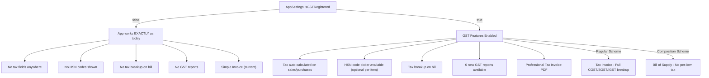
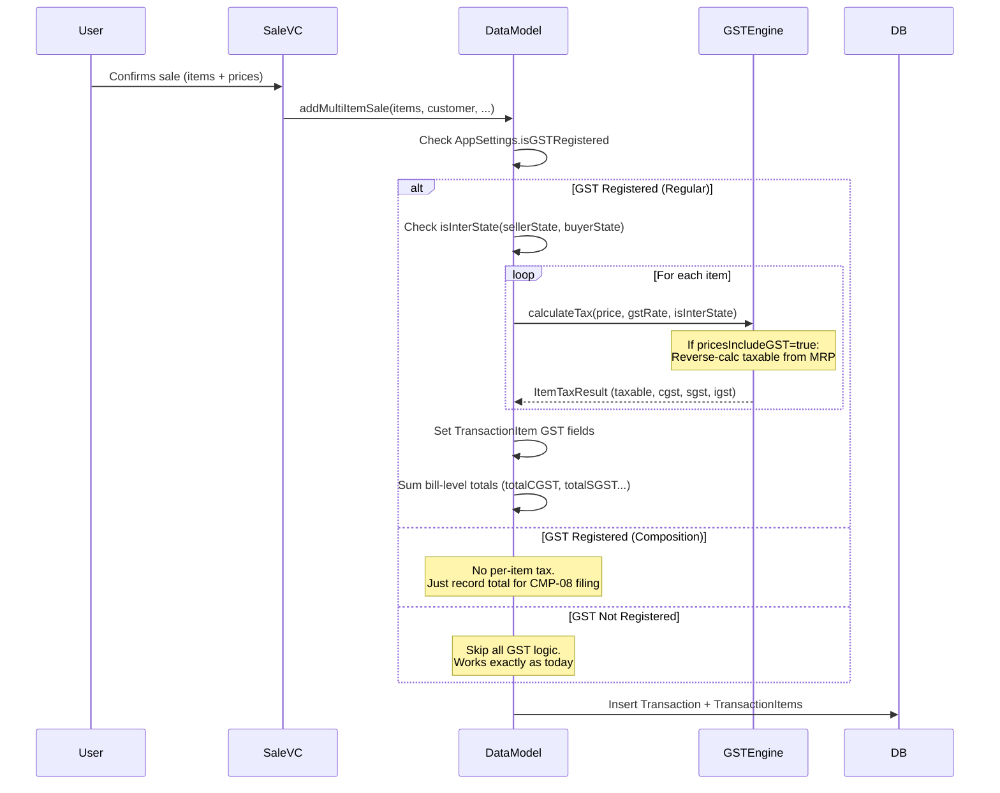

# Ledgile GST Integration — Final Implementation Plan

## Summary

Add **complete GST compliance** to Ledgile with a simple toggle: **GST OFF = app works exactly as today.** GST ON = auto-calculates taxes, generates compliant invoices, and exports GSTR-1/3B JSON for portal upload. Supports both **Regular** and **Composition Scheme**.

---

## The Master Rule: GST is Opt-In



> [!IMPORTANT]
> **Every GST-related UI element, calculation, and report is wrapped in an `if isGSTRegistered` check.** If the user hasn't enabled GST, they see zero GST-related UI. No friction added for non-GST users.

---

## What Happens If HSN Code Is Not Added to an Item?

**Nothing breaks.** Here's the behavior:

| Scenario | On Invoice | In GSTR-1 Export | In App |
|---|---|---|---|
| ✅ HSN code + GST rate set | HSN shown, tax calculated | Included in HSN summary | Full GST line item |
| ✅ No HSN, but GST rate set | HSN column blank, tax still calculated | Grouped under "Others" in HSN summary | GST works normally |
| ✅ No HSN, no GST rate | No tax applied to this item | Appears with 0% tax | Treated as exempt/nil-rated |
| ❌ GST toggle OFF | N/A — no GST anywhere | N/A — no export | Simple app as today |

**HSN is always optional.** The app never blocks a sale because HSN is missing. It just means that specific item won't have HSN on the invoice and will be grouped under "Others" in GSTR-1 export.

---

## Data Model Changes

### `Item` — Add 3 optional fields

```swift
struct Item {
    // ... ALL existing fields unchanged ...
    
    // NEW (all optional — no impact on existing items)
    var hsnCode: String?      // e.g., "19021100"
    var gstRate: Double?      // e.g., 18.0 (percent)
    var cessRate: Double?     // e.g., 12.0 (for tobacco, aerated drinks)
}
```

```sql
-- SQLite migration (backwards compatible — all NULL by default)
ALTER TABLE items ADD COLUMN hsn_code TEXT;
ALTER TABLE items ADD COLUMN gst_rate REAL;
ALTER TABLE items ADD COLUMN cess_rate REAL;
```

### `TransactionItem` — Store per-line tax breakup

```swift
struct TransactionItem {
    // ... ALL existing fields unchanged ...
    
    // NEW (all optional)
    var hsnCode: String?
    var gstRate: Double?
    var taxableValue: Double?     // Price before tax
    var cgstAmount: Double?       // Central GST
    var sgstAmount: Double?       // State GST
    var igstAmount: Double?       // Integrated GST (inter-state)
    var cessAmount: Double?
}
```

```sql
ALTER TABLE transaction_items ADD COLUMN hsn_code TEXT;
ALTER TABLE transaction_items ADD COLUMN gst_rate REAL;
ALTER TABLE transaction_items ADD COLUMN taxable_value REAL;
ALTER TABLE transaction_items ADD COLUMN cgst_amount REAL;
ALTER TABLE transaction_items ADD COLUMN sgst_amount REAL;
ALTER TABLE transaction_items ADD COLUMN igst_amount REAL;
ALTER TABLE transaction_items ADD COLUMN cess_amount REAL;
```

### `Transaction` — Store bill-level tax totals

```swift
struct Transaction {
    // ... ALL existing fields unchanged ...
    
    // NEW (all optional)
    var buyerGSTIN: String?
    var placeOfSupply: String?         // "Maharashtra"
    var placeOfSupplyCode: String?     // "27"
    var isInterState: Bool?
    var totalTaxableValue: Double?
    var totalCGST: Double?
    var totalSGST: Double?
    var totalIGST: Double?
    var totalCess: Double?
    var isReverseCharge: Bool?
}
```

```sql
ALTER TABLE transactions ADD COLUMN buyer_gstin TEXT;
ALTER TABLE transactions ADD COLUMN place_of_supply TEXT;
ALTER TABLE transactions ADD COLUMN place_of_supply_code TEXT;
ALTER TABLE transactions ADD COLUMN is_inter_state INTEGER;
ALTER TABLE transactions ADD COLUMN total_taxable_value REAL;
ALTER TABLE transactions ADD COLUMN total_cgst REAL;
ALTER TABLE transactions ADD COLUMN total_sgst REAL;
ALTER TABLE transactions ADD COLUMN total_igst REAL;
ALTER TABLE transactions ADD COLUMN total_cess REAL;
ALTER TABLE transactions ADD COLUMN is_reverse_charge INTEGER DEFAULT 0;
```

### `AppSettings` — GST configuration

```swift
struct AppSettings {
    // ... ALL existing fields unchanged (including gstNumber which already exists) ...
    
    // NEW
    var isGSTRegistered: Bool         // MASTER TOGGLE — false = no GST features
    var gstScheme: String?            // "regular" or "composition"
    var businessState: String?        // "Maharashtra"
    var businessStateCode: String?    // "27"
    var pricesIncludeGST: Bool        // Default: true (MRP inclusive)
    var defaultGSTRate: Double?       // Most used rate for quick entry (e.g., 18.0)
    var compositionRate: Double?      // 1.0% for manufacturers, 5.0% for restaurants
}
```

```sql
ALTER TABLE app_settings ADD COLUMN is_gst_registered INTEGER NOT NULL DEFAULT 0;
ALTER TABLE app_settings ADD COLUMN gst_scheme TEXT;
ALTER TABLE app_settings ADD COLUMN business_state TEXT;
ALTER TABLE app_settings ADD COLUMN business_state_code TEXT;
ALTER TABLE app_settings ADD COLUMN prices_include_gst INTEGER NOT NULL DEFAULT 1;
ALTER TABLE app_settings ADD COLUMN default_gst_rate REAL;
ALTER TABLE app_settings ADD COLUMN composition_rate REAL;
```

### `BillingDetails` — Add tax breakup

```swift
struct BillingDetails {
    // ... ALL existing fields unchanged ...
    
    // NEW
    var sellerGSTIN: String?
    var sellerState: String?
    var buyerGSTIN: String?
    var buyerState: String?
    var placeOfSupply: String?
    var isInterState: Bool
    var isCompositionScheme: Bool
    var taxBreakup: GSTBreakup?       // nil if GST not registered
}
```

---

## New Structs

```swift
// MARK: - GST Data Structures

struct GSTBreakup {
    let totalTaxableValue: Double
    let totalCGST: Double
    let totalSGST: Double
    let totalIGST: Double
    let totalCess: Double
    var totalTax: Double { totalCGST + totalSGST + totalIGST + totalCess }
    var grandTotal: Double { totalTaxableValue + totalTax }
    let rateWiseSummary: [RateWiseEntry]
}

struct RateWiseEntry {
    let gstRate: Double          // e.g., 18.0
    let taxableValue: Double
    let cgst: Double
    let sgst: Double
    let igst: Double
    let cess: Double
    var totalTax: Double { cgst + sgst + igst + cess }
}

struct ItemTaxResult {
    let taxableValue: Double
    let cgst: Double
    let sgst: Double
    let igst: Double
    let cess: Double
    let totalTax: Double
    let totalWithTax: Double
}
```

---

## Regular vs Composition Scheme

| Aspect | Regular Scheme | Composition Scheme |
|---|---|---|
| Who | Turnover > ₹1.5 Cr (or by choice) | Turnover < ₹1.5 Cr |
| Invoice title | **"Tax Invoice"** | **"Bill of Supply"** |
| Per-item tax breakup | ✅ Yes (CGST/SGST/IGST per line) | ❌ No (can't charge GST to customer) |
| HSN on invoice | ✅ Required (4/6 digit based on turnover) | ❌ Not required |
| Tax rate | Item-specific (5%, 12%, 18%, 28%) | Flat rate on total turnover (1% / 5%) |
| GSTR-1 filing | ✅ Monthly/Quarterly | ❌ Not applicable (files CMP-08 instead) |
| Input Tax Credit | ✅ Can claim ITC | ❌ Cannot claim ITC |
| How it affects the app | Full tax engine runs | Only flat composition tax calculated on total |

### Composition Scheme Invoice (Simplified)

```
┌──────────────────────────────────────────────────┐
│                 BILL OF SUPPLY                    │
│           (Composition Scheme u/s 10)             │
│                                                   │
│  Seller: My Kirana Store                         │
│  GSTIN: 27AABCU9603R1ZM                         │
│                                                   │
│  Customer: Cash Sale                             │
│  Date: 23 Apr 2026                               │
│                                                   │
│  # │ Item         │ Qty │ Rate   │ Amount        │
│  1 │ Maggi        │ 10  │ ₹10    │ ₹100          │
│  2 │ 5 Star       │ 5   │ ₹12    │ ₹60           │
│  ─────────────────────────────────────────       │
│  Total:                            ₹160           │
│                                                   │
│  Note: "Composition taxable person, not          │
│   eligible to collect tax on supplies"           │
│                                                   │
│  Generated by Ledgile                             │
└──────────────────────────────────────────────────┘
```

> [!NOTE]
> Composition scheme dealers **cannot charge tax on their invoices** — they just show total amount. Their tax (1% or 5%) is paid on total quarterly turnover, not per invoice. Our app will calculate this for their quarterly filing.

---

## Regular Scheme Invoice (Full GST)

```
┌──────────────────────────────────────────────────────┐
│                    TAX INVOICE                        │
│                                                       │
│  ┌─ SELLER ──────────────┐ ┌─ INVOICE ──────────────┐│
│  │ My Kirana Store       │ │ Invoice: 26-27/INV-0001││
│  │ 123 Main Road,        │ │ Date: 23 Apr 2026      ││
│  │ Mumbai 400001         │ │ Place of Supply: MH(27) ││
│  │ GSTIN: 27AABCU9603R1ZM│ │ Reverse Charge: No     ││
│  │ Ph: 9876543210        │ │ State: Maharashtra (27) ││
│  └───────────────────────┘ └─────────────────────────┘│
│                                                       │
│  BUYER: Rahul Sharma                                  │
│  GSTIN: _______________  (if B2B)                     │
│                                                       │
│ ┌────────────────────────────────────────────────────┐│
│ │ # │ Item     │ HSN    │ Qty │ Rate  │ Taxable     ││
│ │───│──────────│────────│─────│───────│─────────────││
│ │ 1 │ Maggi    │ 190211 │ 10  │ ₹10   │ ₹84.75     ││
│ │ 2 │ 5 Star   │ 180631 │  5  │ ₹12   │ ₹50.85     ││
│ │ 3 │ Rice 5kg │ —      │  2  │ ₹110  │ ₹209.52    ││
│ └────────────────────────────────────────────────────┘│
│                                                       │
│  ┌─ TAX BREAKUP (INTRA-STATE) ──────────────────────┐│
│  │ Rate  │ Taxable  │ CGST    │ SGST    │ Tax Total ││
│  │ 18%   │ ₹135.60  │ ₹12.20  │ ₹12.20  │ ₹24.41  ││
│  │  5%   │ ₹209.52  │ ₹5.24   │ ₹5.24   │ ₹10.48  ││
│  │  0%   │ ₹0.00    │ ₹0.00   │ ₹0.00   │ ₹0.00   ││
│  └───────────────────────────────────────────────────┘│
│                                                       │
│  Taxable Value:       ₹345.12                         │
│  CGST:                ₹17.44                          │
│  SGST:                ₹17.44                          │
│  Round Off:           -₹0.01                          │
│  ─────────────────────────────                        │
│  GRAND TOTAL:         ₹380.00                         │
│                                                       │
│  Amount in words: Three Hundred Eighty Rupees Only    │
│                                                       │
│  Terms: E. & O.E. │ Generated by Ledgile             │
└──────────────────────────────────────────────────────┘
```

> Note: Item #3 "Rice 5kg" has no HSN set — it just shows "—" in the HSN column. **No error, no blocking.**

---

## All 18 Reports

### NEW GST Reports (6)

| # | Report | Format | What It Shows |
|---|---|---|---|
| 1 | **GSTR-1 Export** | JSON | B2B invoices, B2CS summary, HSN summary — upload to GST portal |
| 2 | **GSTR-3B Summary** | JSON + PDF | Output tax, input tax credit, net payable |
| 3 | **GST Tax Summary** | PDF | Monthly CGST/SGST/IGST collected vs paid |
| 4 | **Output Tax Register** | PDF | Every sale with full tax breakup |
| 5 | **Input Tax Credit Register** | PDF | Every purchase with tax paid (ITC claimable) |
| 6 | **HSN-wise Summary** | PDF | Quantity, taxable value, tax per HSN code |

> [!NOTE]
> All 6 GST reports are **hidden when GST toggle is OFF**. They only appear in Reports section when `isGSTRegistered = true`.

### EXISTING Reports (12) — Enhanced with GST columns

| # | Report | GST Enhancement |
|---|---|---|
| 7 | Profit & Loss | Add: Revenue after tax, tax-adjusted profit |
| 8 | Sales Register | Add columns: Taxable Value, CGST, SGST, IGST |
| 9 | Purchase Register | Add: Supplier GSTIN, Input Tax |
| 10 | Stock Summary | Add: HSN code, GST rate columns |
| 11 | Expiry Alert | No change |
| 12 | Fast Moving Items | No change |
| 13 | Slow / Dead Stock | No change |
| 14 | Item Profitability | Tax-exclusive pricing for true margins |
| 15 | Customer Ledger | Add tax breakup per transaction |
| 16 | Supplier Ledger | Add input tax per supplier |
| 17 | Outstanding Receivables | No change |
| 18 | Outstanding Payables | No change |

> Existing report enhancements only add extra columns **when GST is ON**. When OFF, reports look exactly as they do today.

---

## New Files to Create (6)

| # | File | Size | Purpose |
|---|---|---|---|
| 1 | `Models/GSTEngine.swift` | ~200 lines | Tax calculation (CGST/SGST/IGST), MRP reverse calc, state matching |
| 2 | `Models/HSNDatabase.swift` | ~100 lines | Search/lookup among 12,167 HSN codes |
| 3 | `Models/GSTReturnExporter.swift` | ~300 lines | Generate GSTR-1 & GSTR-3B JSON |
| 4 | `Models/NumberToWords.swift` | ~80 lines | ₹380 → "Three Hundred Eighty Rupees Only" |
| 5 | `Models/IndianStates.swift` | ~60 lines | All 37 states/UTs with 2-digit codes |
| 6 | `Resources/hsn_codes.json` | ~500 KB | Full 12,167 HSN code database |

---

## Existing Files to Modify (10)

| # | File | What Changes | Effort |
|---|---|---|---|
| 1 | [Model.swift](file:///Users/apple/Desktop/UiRework/Ledgile%20Merged/Tabs/Models/Model.swift) | Add GST fields to `Item`, `Transaction`, `TransactionItem`, `AppSettings` + new structs | Medium |
| 2 | [BillingDetails.swift](file:///Users/apple/Desktop/UiRework/Ledgile%20Merged/Tabs/Models/BillingDetails.swift) | Add GST fields + `GSTBreakup` | Small |
| 3 | [SQLiteDatabase.swift](file:///Users/apple/Desktop/UiRework/Ledgile%20Merged/Tabs/Models/SQLiteDatabase.swift) | ALTER TABLE migrations + update all read/write/bind methods | Large |
| 4 | [DataModel.swift](file:///Users/apple/Desktop/UiRework/Ledgile%20Merged/Tabs/Models/DataModel.swift) | Call `GSTEngine` inside `addMultiItemSale`, `addMultiItemPurchase`, `addSale`, `addPurchase` | Medium |
| 5 | [Transaction+BillingDetails.swift](file:///Users/apple/Desktop/UiRework/Ledgile%20Merged/Tabs/Models/Transaction+BillingDetails.swift) | Map GST fields from Transaction to BillingDetails | Small |
| 6 | [BillTableViewController.swift](file:///Users/apple/Desktop/UiRework/Ledgile%20Merged/Tabs/SalesTab/ManualSalesEntry/Controller/BillTableView%20Functionality/BillTableViewController.swift) | Add tax breakup rows + completely rewrite `renderBillAsPDF()` for GST template | Large |
| 7 | [ProfileTableViewController.swift](file:///Users/apple/Desktop/UiRework/Ledgile%20Merged/Tabs/User%20Profile/Controller/ProfileTableViewController.swift) | Add "GST Settings" row under General + GST reports under Reports section | Medium |
| 8 | [ReportGenerator.swift](file:///Users/apple/Desktop/UiRework/Ledgile%20Merged/Tabs/Models/ReportGenerator.swift) | Add 6 new report types + enhance existing reports with GST columns | Large |
| 9 | [GeminiPromptTemplates.swift](file:///Users/apple/Desktop/UiRework/Ledgile%20Merged/Tabs/Models/GeminiPromptTemplates.swift) | Update purchase bill prompt to EXTRACT GST/CGST/SGST/HSN instead of ignoring them | Small |
| 10 | [GeminiService.swift](file:///Users/apple/Desktop/UiRework/Ledgile%20Merged/Tabs/Models/GeminiService.swift) | Parse GST fields from Gemini response JSON | Small |

---

## Sale Flow — With vs Without GST

### GST OFF (No change from today)

```
User adds sale → DataModel.addMultiItemSale() → saves as-is → simple invoice PDF
```

### GST ON (New flow)



---

## Gemini Enhancement — Extract GST from Scanned Bills

### Current Behavior

```swift
// GeminiPromptTemplates.swift line 89:
"Ignore lines with: total, subtotal, GST, CGST, SGST, tax, discount, thank you, signature"
```

### New Behavior (when GST is ON)

```swift
// Purchase bill prompt gets GST-aware version:
static let billPurchaseSystemGST = """
... existing rules ...

ADDITIONAL (GST mode):
- DO extract GSTIN from the bill header (15-character alphanumeric)
- DO extract HSN codes if printed next to items
- DO extract CGST%, SGST%, IGST% if shown per item
- DO extract total CGST, SGST, IGST amounts from the bill footer
- Invoice number and date should be captured
"""

static let billPurchaseSchemaGST = """
{
  "supplier": "string or null",
  "supplier_gstin": "string or null",
  "invoice_number": "string or null",
  "invoice_date": "string or null",
  "items": [
    {
      "name": "string",
      "category_alias": "string or null",
      "quantity": "string",
      "unit": "string or null",
      "cost_price": "string or null",
      "selling_price": "string or null",
      "hsn_code": "string or null",
      "gst_rate": "string or null"
    }
  ],
  "total_cgst": "string or null",
  "total_sgst": "string or null",
  "total_igst": "string or null",
  "total_taxable_value": "string or null"
}
"""
```

> The app dynamically picks the GST-aware or non-GST prompt based on `isGSTRegistered`.

---

## GST Settings UI (New Section in Profile)

### When GST is OFF

Profile shows a single row under General:

```
┌──────────────────────────────────────────┐
│  🧾 GST Settings                    ▸   │
│     Not registered                       │
└──────────────────────────────────────────┘
```

### GST Setup Screen (pushed when tapped)

```
┌──────────────────────────────────────────┐
│  GST Registration                        │
│                                          │
│  GST Registered?          [  OFF  /  ON ]│
│                                          │
│  ─── (shown only when ON) ───            │
│                                          │
│  GSTIN:           [27AABCU9603R1ZM    ]  │
│  Business State:  [Maharashtra ▼      ]  │
│  Scheme:          [Regular] [Composition]│
│                                          │
│  ─── Pricing ───                         │
│  Prices Include GST?     [ON  / OFF    ] │
│  Default GST Rate:       [18% ▼        ] │
│                                          │
│  ─── Composition Only ───                │
│  Composition Rate:       [1% ▼         ] │
│                                          │
│  [Save]                                  │
└──────────────────────────────────────────┘
```

---

## Implementation Phases

### Phase 1: Data Foundation
- [ ] Write SQLite migration function for all ALTER TABLE statements
- [ ] Add GST fields to all model structs in `Model.swift`
- [ ] Update `AppSettings` with GST config fields
- [ ] Update `SQLiteDatabase.swift` — all read/write/bind methods
- [ ] Update `BillingDetails.swift` with GST fields
- [ ] Add new GST structs (`GSTBreakup`, `RateWiseEntry`, `ItemTaxResult`)
- [ ] Verify: Existing data loads fine with new nullable columns

### Phase 2: GST Engine + HSN Database
- [ ] Create `GSTEngine.swift` — calculate CGST/SGST/IGST, MRP reverse calc
- [ ] Create `IndianStates.swift` — 37 states/UTs with codes
- [ ] Create `HSNDatabase.swift` — load and search hsn_codes.json
- [ ] Create `NumberToWords.swift` — amount in words converter
- [ ] Bundle `hsn_codes.json` — full 12,167 HSN code database
- [ ] Unit test all GSTEngine calculations

### Phase 3: Sale/Purchase Flow Integration
- [ ] Modify `DataModel.addMultiItemSale()` — inject GST calculation
- [ ] Modify `DataModel.addMultiItemPurchase()` — store GST for ITC
- [ ] Modify `DataModel.addSale()` — single-item GST
- [ ] Modify `DataModel.addPurchase()` — single-item GST
- [ ] Modify `DataModel.recordSaleWithoutStockCheck()` — GST support
- [ ] Update `Transaction+BillingDetails.swift` — map GST fields
- [ ] Handle composition scheme flow (no per-item tax)

### Phase 4: UI — Invoice Template + Settings
- [ ] Build GST Settings screen (toggle, GSTIN, state picker, scheme)
- [ ] Add GST Settings row to `ProfileTableViewController`
- [ ] Add HSN code picker to item add/edit screen (optional field)
- [ ] Add buyer GSTIN field to sale entry (optional, for B2B)
- [ ] Add tax breakup rows to `BillTableViewController`
- [ ] Rewrite `renderBillAsPDF()` — professional GST invoice / Bill of Supply
- [ ] Update Gemini prompts — GST-aware purchase bill scanning

### Phase 5: Reports + GSTR Export
- [ ] Create `GSTReturnExporter.swift` — GSTR-1 & GSTR-3B JSON
- [ ] Add `ReportType` cases: `.gstSummary`, `.outputTaxRegister`, `.inputTaxCredit`, `.hsnSummary`, `.gstr1Export`, `.gstr3bSummary`
- [ ] Draw all 6 new GST reports in `ReportGenerator.swift`
- [ ] Enhance existing reports with GST columns (when GST ON)
- [ ] Add GST report rows to Profile (hidden when GST OFF)
- [ ] Test: Generate GSTR-1 JSON → validate against portal schema
- [ ] Test: Full cycle sale → invoice → report → export

---

## Verification Plan

### Automated Tests
- [ ] GSTEngine: 0%, 5%, 12%, 18%, 28% calculations
- [ ] GSTEngine: MRP-inclusive reverse calculation (₹118 @ 18% → ₹100 + ₹18)
- [ ] GSTEngine: Intra-state → CGST+SGST, Inter-state → IGST
- [ ] GSTEngine: Composition scheme flat rate
- [ ] HSNDatabase: Search accuracy (query "maggi" returns noodles/pasta codes)
- [ ] NumberToWords: Edge cases (₹0, ₹1, ₹99,999)
- [ ] GSTR-1 JSON: Validate against portal schema

### Manual Testing
- [ ] Toggle GST OFF → entire app unchanged, no GST UI visible
- [ ] Toggle GST ON (Regular) → tax breakup appears on bills
- [ ] Toggle GST ON (Composition) → "Bill of Supply" shown
- [ ] Sale with no HSN items → invoice works, HSN column shows "—"
- [ ] Sale with mixed HSN/no-HSN → both work correctly
- [ ] Inter-state sale → IGST shown instead of CGST+SGST
- [ ] Scan purchase bill → GSTIN and HSN extracted by Gemini
- [ ] Export GSTR-1 → valid JSON file shared
- [ ] Print invoice via AirPrint → all fields readable
