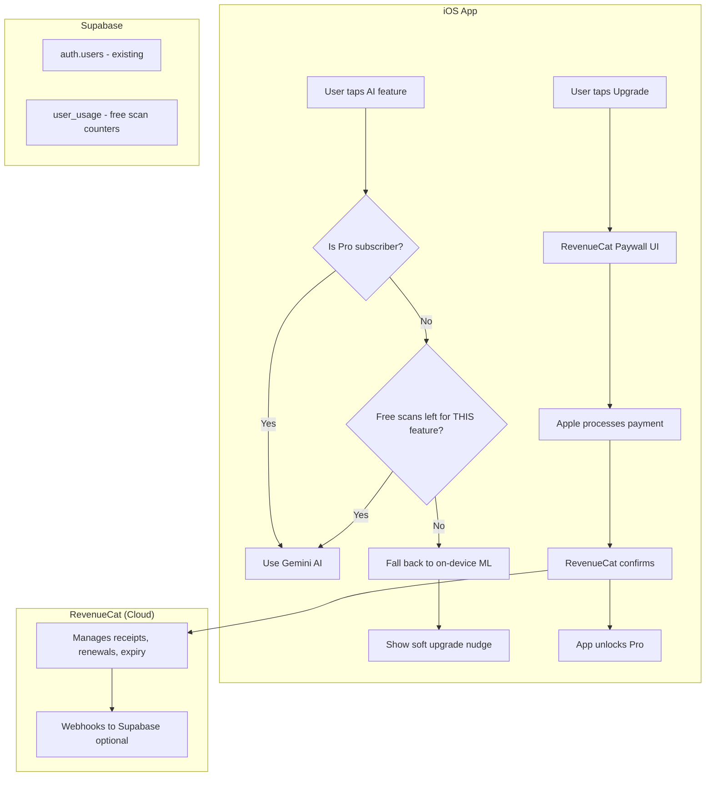

# Ledgile Pro — RevenueCat Subscription Integration Plan

## Summary

Integrate a **freemium subscription** into Ledgile using **RevenueCat** (wraps Apple StoreKit 2). Users get **10 free AI scans per feature** as a demo. After exhaustion, Gemini features gracefully **fall back to on-device ML** (soft paywall). Pro unlocks unlimited Gemini AI + all 12 PDF reports.

---

## Architecture Overview



---

## Pricing Strategy (Final)

### Tier Structure

| Plan | Price (India) | Price (USD) | Billing |
|------|--------------|-------------|---------|
| **Free** | ₹0 | $0 | — |
| **Monthly Pro** | ₹149/mo | $1.99/mo | Monthly |
| **Annual Pro** | ₹999/yr | $11.99/yr | Yearly (save 44%) |

### Free vs Premium Features

| Feature | Free | Pro |
|---------|------|-----|
| Manual sales/purchase entry | ✅ | ✅ |
| Inventory management | ✅ | ✅ |
| Dashboard & charts | ✅ | ✅ |
| Barcode scanning | ✅ | ✅ |
| Credit/debit tracking | ✅ | ✅ |
| On-device bill scanning (OCR) | ✅ Always | ✅ Always |
| On-device voice parsing | ✅ Always | ✅ Always |
| **AI Bill Scanning (Gemini)** | 10 free uses | ✅ Unlimited |
| **AI Voice Sales Entry (Gemini)** | 10 free uses | ✅ Unlimited |
| **AI Product Detection (Gemini)** | 10 free uses | ✅ Unlimited |
| **AI Purchase Bill Scan (Gemini)** | 10 free uses | ✅ Unlimited |
| **PDF Reports** | 3 basic types | ✅ All 12 types |

> [!NOTE]
> **Each Gemini feature has its OWN 10 free uses** (total = 40 free AI actions across all features). This is generous enough to hook users.

### Free Reports (3 types)

| Free Reports | Pro-Only Reports |
|---|---|
| Profit & Loss | Fast Moving Items |
| Sales Register | Slow / Dead Stock |
| Stock Summary | Item Profitability |
| | Purchase Register |
| | Expiry Alert |
| | Customer Ledger |
| | Supplier Ledger |
| | Outstanding Receivables |
| | Outstanding Payables |

### Soft Paywall Behavior

| Feature | Free (scans left) | Free (scans exhausted) | Pro |
|---|---|---|---|
| Bill Scan | Gemini AI | Falls back to on-device OCR + nudge banner | Gemini AI |
| Voice Entry | Gemini AI | Falls back to on-device voice + nudge banner | Gemini AI |
| Product Detection | Gemini AI | Falls back to on-device CLIP + nudge banner | Gemini AI |
| Purchase Bill | Gemini AI | Falls back to on-device OCR + nudge banner | Gemini AI |
| Pro-only reports | ❌ Locked with upgrade prompt | ❌ Locked with upgrade prompt | ✅ Unlocked |

---

## RevenueCat Integration — Step by Step

### Prerequisites

1. **Apple Developer Account** ($99/yr) — needed for In-App Purchase products
2. **RevenueCat account** — free at [app.revenuecat.com](https://app.revenuecat.com)
3. **Supabase project** — you already have this

### Step 1: App Store Connect Setup

Create two auto-renewable subscription products:

| Product ID | Display Name | Price |
|---|---|---|
| `com.ledgile.pro.monthly` | Ledgile Pro Monthly | ₹149 / $1.99 |
| `com.ledgile.pro.annual` | Ledgile Pro Annual | ₹999 / $11.99 |

Both go under **one subscription group** called `ledgile_pro`.

### Step 2: RevenueCat Dashboard Setup

1. Create a new project "Ledgile" in RevenueCat
2. Connect your App Store Connect app
3. Create an **Entitlement**: `pro`
4. Create **Products**: map the two product IDs above
5. Create an **Offering** with both products
6. Copy your **RevenueCat API Key** (public key for iOS)

### Step 3: RevenueCat Paywall Template

RevenueCat provides pre-built paywall templates you configure from the dashboard:
- Select a template (e.g., "Template 5 — Features list")
- Configure the title, features list, colors
- Test in preview mode
- No custom Swift UI code needed for the paywall itself

---

## Supabase — What's Needed

### Only 1 table needed: `user_usage`

Since RevenueCat handles ALL subscription state (active/expired/cancelled/renewal), Supabase only needs to track the **free scan counters**. This gives us server-side truth so users can't reset counts by reinstalling the app.

```sql
CREATE TABLE user_usage (
    user_id UUID PRIMARY KEY REFERENCES auth.users(id) ON DELETE CASCADE,
    
    -- Per-feature free scan counters (each gets 10)
    bill_scan_count INT NOT NULL DEFAULT 0,
    voice_sale_count INT NOT NULL DEFAULT 0,
    product_detect_count INT NOT NULL DEFAULT 0,
    purchase_bill_count INT NOT NULL DEFAULT 0,
    
    -- Limits (configurable per user if needed)
    free_limit INT NOT NULL DEFAULT 10,
    
    -- Timestamps
    first_used_at TIMESTAMPTZ,
    last_used_at TIMESTAMPTZ,
    created_at TIMESTAMPTZ DEFAULT now(),
    updated_at TIMESTAMPTZ DEFAULT now()
);

-- Auto-create row when user signs up (trigger)
CREATE OR REPLACE FUNCTION create_user_usage()
RETURNS TRIGGER AS $$
BEGIN
    INSERT INTO user_usage (user_id) VALUES (NEW.id);
    RETURN NEW;
END;
$$ LANGUAGE plpgsql SECURITY DEFINER;

CREATE TRIGGER on_auth_user_created
    AFTER INSERT ON auth.users
    FOR EACH ROW
    EXECUTE FUNCTION create_user_usage();

-- RLS policies
ALTER TABLE user_usage ENABLE ROW LEVEL SECURITY;

CREATE POLICY "Users can view own usage"
ON user_usage FOR SELECT
USING (auth.uid() = user_id);

CREATE POLICY "Users can update own usage"
ON user_usage FOR UPDATE
USING (auth.uid() = user_id)
WITH CHECK (auth.uid() = user_id);
```

### Connect Supabase to the App

Update `Secrets.xcconfig` with your real Supabase credentials:

```
SUPABASE_URL = https://xxxxx.supabase.co
SUPABASE_ANON_KEY = eyJhbGciOiJIUzI1NiIs...
```

---

## New Files to Create

### 1. `Models/SubscriptionManager.swift` — Core RevenueCat wrapper

```swift
// Responsibilities:
// - Initialize RevenueCat on app launch
// - Check if user has "pro" entitlement
// - Present paywall
// - Listen for subscription changes
// - Identify user with Supabase user ID

import RevenueCat
import RevenueCatUI

final class SubscriptionManager {
    static let shared = SubscriptionManager()
    
    var isProUser: Bool  // checks RevenueCat entitlements
    
    func configure()     // call in AppDelegate
    func identifyUser()  // link RevenueCat ↔ Supabase user ID
    func presentPaywall(from vc: UIViewController)
    func restorePurchases()
    func checkEntitlements() async
}
```

### 2. `Models/UsageService.swift` — Supabase usage sync

```swift
// Responsibilities:
// - Fetch per-feature scan counts from Supabase
// - Increment count after successful Gemini usage
// - Cache locally in UserDefaults for offline access
// - Sync when online

final class UsageService {
    static let shared = UsageService()
    
    func canUseFeature(_ feature: GeminiFeature) -> Bool
    func recordUsage(_ feature: GeminiFeature)
    func remainingUses(_ feature: GeminiFeature) -> Int
    func syncWithSupabase()
    
    enum GeminiFeature: String {
        case billScan       // bill_scan_count
        case voiceSale      // voice_sale_count
        case productDetect  // product_detect_count
        case purchaseBill   // purchase_bill_count
    }
}
```

### 3. `Subscription/ScanUsageBannerView.swift` — Scan counter banner

A small banner shown on scanner screen for free users:

```
┌──────────────────────────────────────────┐
│  ⚡ 7 free AI scans left  [Upgrade Pro] │
└──────────────────────────────────────────┘
```

When exhausted:

```
┌──────────────────────────────────────────┐
│  📷 Using on-device scanner  [Go Pro →] │
└──────────────────────────────────────────┘
```

### 4. `Subscription/ReportLockView.swift` — Pro-only report lock

Overlay shown when tapping a Pro-only report:

```
┌──────────────────────────────────────────┐
│               🔒                         │
│   This report requires Ledgile Pro      │
│                                          │
│   [Upgrade Now]    [Cancel]              │
└──────────────────────────────────────────┘
```

---

## Existing Files to Modify

### 1. `AppDelegate.swift` — Initialize RevenueCat

```swift
// ADD: Import and configure RevenueCat
import RevenueCat

func application(_ application: UIApplication, 
                 didFinishLaunchingWithOptions...) -> Bool {
    Purchases.logLevel = .debug  // remove in production
    Purchases.configure(withAPIKey: "appl_YOUR_REVENUECAT_KEY")
    return true
}
```

### 2. `UsageTracker.swift` — Replace with real logic

**Current code** (hardcoded `return true`):
```swift
var canUseGemini: Bool {
    return true  // ← this needs to change
}
```

**New logic:**
```swift
var canUseGemini: Bool {
    if SubscriptionManager.shared.isProUser { return true }
    // Feature-specific check handled by UsageService
    return true  // caller should use UsageService for per-feature checks
}
```

### 3. `GeminiService.swift` — Add per-feature gating

Each public method gets a feature gate check:

```swift
func parseBillForSale(image: UIImage, completion: @escaping (ParsedResult?) -> Void) {
    // NEW: Check if user can use this specific feature
    guard UsageService.shared.canUseFeature(.billScan) else {
        print("[GeminiService] Bill scan limit reached, caller should use on-device")
        completion(nil)  // nil triggers on-device fallback in ScanCameraViewController
        return
    }
    
    // ... existing Gemini API call ...
    
    // After success:
    UsageService.shared.recordUsage(.billScan)  // NEW
    UsageTracker.shared.recordGeminiUsage()       // existing
}
```

Same pattern for `parseVoiceForSale`, `identifyProducts`, `parseBillForPurchase`.

### 4. `ScanCameraViewController.swift` — Add banner + soft fallback

The scan camera already has fallback logic! Look at the existing code:

```swift
// EXISTING (already works!):
if GeminiService.shared.isConfigured {
    GeminiService.shared.parseBillForSale(image: image) { result in
        if let result = result { /* use Gemini result */ }
        else { self.processBillOnDevice(image: image, cgImage: cgImage) }  // ← FALLBACK
    }
} else {
    self.processBillOnDevice(image: image, cgImage: cgImage)  // ← ON-DEVICE
}
```

**Changes needed:**
- Add `ScanUsageBannerView` at top of screen
- The fallback already works — when `GeminiService` returns `nil` (because usage exhausted), it falls back to `processBillOnDevice` automatically
- Add nudge banner: "Using on-device scanner. Upgrade for AI accuracy."

### 5. `ProfileTableViewController.swift` — Add subscription section

Add a new section at position 1 (after profile header):

```swift
// New section: Subscription
case subscription  // between .profile and .general

// Cell content:
// Pro user: "⭐ Ledgile Pro — Active (renews May 23)"
// Free user: "🔓 Upgrade to Pro" + usage progress bars
```

Tapping it presents the RevenueCat paywall.

### 6. `ReportGenerator.swift` — No changes needed

The gating happens in `ProfileTableViewController` when user taps a report type:

```swift
// In handleProfileReportTap:
let freeReports: Set<ReportType> = [.profitAndLoss, .salesRegister, .stockSummary]

if !freeReports.contains(reportType) && !SubscriptionManager.shared.isProUser {
    // Show ReportLockView instead of generating
    showReportLockAlert(for: reportType)
    return
}
// else: generate report as normal
```

### 7. `SceneDelegate.swift` — Refresh subscription on launch

```swift
func sceneWillEnterForeground(_ scene: UIScene) {
    // Refresh subscription status when app comes to foreground
    Task {
        await SubscriptionManager.shared.checkEntitlements()
    }
    
    // Sync usage counters with Supabase
    if AuthManager.shared.isLoggedIn {
        UsageService.shared.syncWithSupabase()
    }
}
```

---

## Dependencies to Add (SPM)

Add via Xcode → File → Add Package Dependencies:

| Package | URL | Purpose |
|---|---|---|
| RevenueCat | `https://github.com/RevenueCat/purchases-ios.git` | Subscription management |
| RevenueCatUI | Included in above | Pre-built paywall UI |

> [!NOTE]
> RevenueCatUI is included in the same package. When adding, select both `RevenueCat` and `RevenueCatUI` product targets.

---

## Implementation Phases

### Phase 1: Setup & Configuration
- [ ] Create subscription products in App Store Connect
- [ ] Create RevenueCat project & configure
- [ ] Add RevenueCat SPM dependency to Xcode project
- [ ] Create `SubscriptionManager.swift` with basic init
- [ ] Update `AppDelegate.swift` to configure RevenueCat
- [ ] Connect Supabase — update `Secrets.xcconfig` with real credentials
- [ ] Create `user_usage` table in Supabase
- [ ] Set up Supabase trigger for auto-creating usage rows

### Phase 2: Usage Tracking
- [ ] Create `UsageService.swift` with per-feature counters
- [ ] Modify `UsageTracker.swift` — replace hardcoded `return true`
- [ ] Add feature gates to `GeminiService.swift` (all 4 methods)
- [ ] Add Supabase sync for usage counters
- [ ] Verify: when count hits 10, Gemini returns nil → on-device fallback kicks in

### Phase 3: UI Components
- [ ] Configure RevenueCat Paywall template in dashboard
- [ ] Build `ScanUsageBannerView.swift` — scan count banner
- [ ] Build `ReportLockView.swift` — Pro report lock overlay
- [ ] Add subscription section to `ProfileTableViewController`
- [ ] Add "Upgrade" button triggers throughout the app

### Phase 4: Feature Gating
- [ ] Gate Gemini in `ScanCameraViewController` (bill scan)
- [ ] Gate Gemini in voice sales entry
- [ ] Gate Gemini in product detection (live scanner)
- [ ] Gate Gemini in purchase bill scan
- [ ] Gate Pro-only reports in profile
- [ ] Add soft nudge banner when using on-device fallback

### Phase 5: Testing
- [ ] Test StoreKit sandbox purchase flow
- [ ] Test free scans → exhaustion → on-device fallback
- [ ] Test Pro purchase → unlimited AI access
- [ ] Test subscription expiry → features lock again
- [ ] Test "Restore Purchases" flow
- [ ] Test offline behavior (cached subscription state)
- [ ] Test fresh install (usage syncs from Supabase)

---

## Complete File Map

### New Files (4)

| # | File Path | Purpose |
|---|---|---|
| 1 | `Tabs/Models/SubscriptionManager.swift` | RevenueCat wrapper, entitlement checks, paywall |
| 2 | `Tabs/Models/UsageService.swift` | Per-feature free scan tracking + Supabase sync |
| 3 | `Tabs/Subscription/ScanUsageBannerView.swift` | Banner showing remaining scans |
| 4 | `Tabs/Subscription/ReportLockView.swift` | Lock overlay for Pro-only reports |

### Modified Files (7)

| # | File | Change |
|---|---|---|
| 1 | [AppDelegate.swift](file:///Users/apple/Desktop/UiRework/Ledgile%20Merged/Tabs/AppDelegate.swift) | Add RevenueCat init |
| 2 | [UsageTracker.swift](file:///Users/apple/Desktop/UiRework/Ledgile%20Merged/Tabs/Models/UsageTracker.swift) | Replace hardcoded `true` with real checks |
| 3 | [GeminiService.swift](file:///Users/apple/Desktop/UiRework/Ledgile%20Merged/Tabs/Models/GeminiService.swift) | Add per-feature gates, record usage |
| 4 | [ScanCameraViewController.swift](file:///Users/apple/Desktop/UiRework/Ledgile%20Merged/Tabs/VisionTab/ScanCameraViewController.swift) | Add usage banner, soft fallback nudge |
| 5 | [ProfileTableViewController.swift](file:///Users/apple/Desktop/UiRework/Ledgile%20Merged/Tabs/User%20Profile/Controller/ProfileTableViewController.swift) | Add subscription section |
| 6 | [SceneDelegate.swift](file:///Users/apple/Desktop/UiRework/Ledgile%20Merged/Tabs/SceneDelegate.swift) | Refresh subscription on foreground |
| 7 | [Secrets.xcconfig](file:///Users/apple/Desktop/UiRework/Ledgile%20Merged/Secrets.xcconfig) | Add RevenueCat API key |

### Supabase (1 table + 1 trigger)

| What | Details |
|---|---|
| Table | `user_usage` — 4 feature counters + limits |
| Trigger | Auto-create usage row on auth.users insert |
| RLS | Users can read/update only their own row |

---

## What RevenueCat Handles For Us (Things We DON'T Build)

| Concern | RevenueCat handles it? |
|---|---|
| Apple receipt validation | ✅ Automatic |
| Subscription state (active/expired/cancelled) | ✅ Automatic |
| Auto-renewal handling | ✅ Automatic |
| Grace period / billing retry | ✅ Automatic |
| Pre-built paywall UI | ✅ Dashboard configurable |
| Restore purchases | ✅ Built-in button |
| Analytics (revenue, MRR, churn) | ✅ Dashboard |
| Price localization per country | ✅ Apple handles |

---

## Verification Plan

### Automated Tests
- StoreKit sandbox purchase in Xcode (Configuration → StoreKit)
- Verify each feature counter increments correctly
- Verify fallback to on-device when counter hits 10

### Manual Verification  
- Full purchase flow on real device with sandbox Apple ID
- Kill app → reopen → verify subscription state persists
- Delete & reinstall app → verify usage syncs from Supabase
- Let sandbox subscription expire → verify Pro features lock
- Tap "Restore Purchases" on clean install → verify unlock
