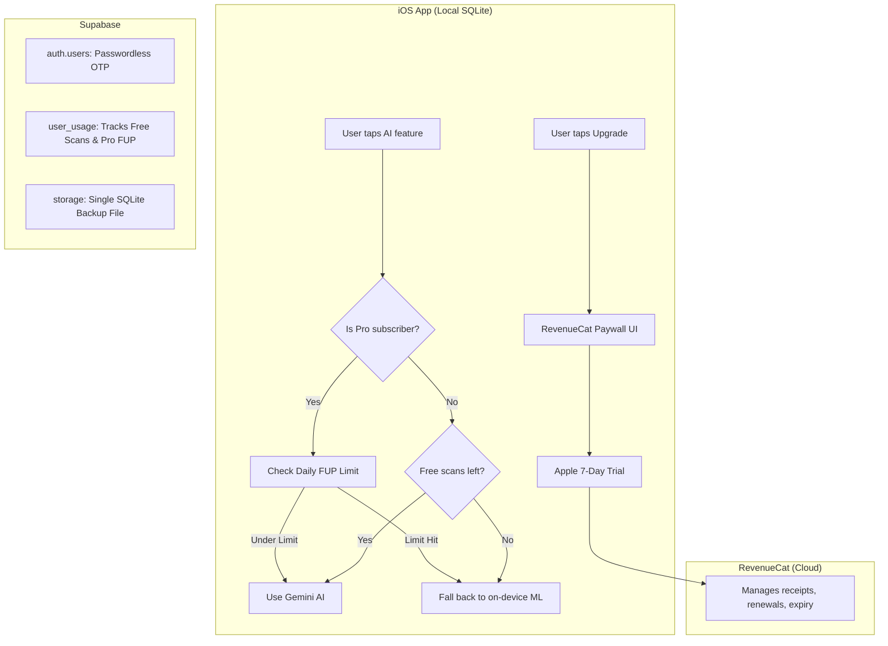

# Ledgile Pro — Subscription & Backend Integration Plan

## Summary

Integrate a **freemium subscription** into Ledgile using **RevenueCat** for payments and **Supabase** for backend services (Auth, Usage Tracking, Backup). 

**The Conversion Funnel:**
1. **Free Hook:** New users get **10 free AI scans** per feature (no credit card needed).
2. **Soft Wall:** Upon exhaustion, AI features fall back to on-device ML.
3. **Risk-Free Trial:** Upgrading triggers a **7-Day Free Trial** via Apple (requires card).
4. **Conversion:** After 7 days, user is billed automatically.

---

## Architecture Overview



---

## Pricing Strategy & Feature Gating

### Tier Structure

| Plan | Price (India) | Price (USD) | Trial | Expected Profit/User/Mo |
|------|--------------|-------------|-------|-------------------------|
| **Free** | ₹0 | $0 | — | — |
| **Monthly Pro** | **₹199/mo** | $2.49/mo | 7 Days Free | ~₹128 (Normal User) |
| **Annual Pro** | **₹1,999/yr** | $24.99/yr | 7 Days Free | ~₹104 (Normal User) |

### Free vs Premium Features

| Feature | Free | Pro |
|---------|------|-----|
| Manual entries, dashboard, inventory | ✅ | ✅ |
| On-device OCR / Voice / Product ML | ✅ Always | ✅ Always |
| **AI Voice Entry (Gemini)** | 10 free uses | ✅ **Up to 300/day** |
| **AI Bill Scanning (Gemini)** | 10 free uses | ✅ **Up to 100/day** |
| **Cloud Database Backup** | ❌ Locked | ✅ **Daily Sync** |
| **GST Compliance Engine** | ❌ Locked | ✅ **Unlocked** |
| **PDF Reports** | 3 basic types | ✅ All 12 types + GSTR |

> [!IMPORTANT]
> **Fair Usage Policy (FUP):** The daily limits of 300 Voice / 100 Scans guarantee that the absolute maximum API/Server cost per user never exceeds ₹97.50/month. This strictly protects the profit margins of the Annual Plan.

---

## Supabase Implementation Strategy

### 1. Passwordless Onboarding (Auth)
To maximize conversion and minimize UI, Ledgile uses Passwordless OTP.
- **UI:** Ask for Shop Name, User Name, Phone/Email.
- **Backend:** Call `supabase.auth.signInWithOTP()`.
- No "Forgot Password" or "Reset" logic required.

### 2. Cost-Optimized Cloud Backup (Storage)
To prevent server costs from blooming, Ledgile **does not store bill photos in the cloud**.
- **Action:** Bill photos are deleted from memory immediately after Gemini extracts the data.
- **Backup:** Every night, the app uploads the local `Ledgile.sqlite` file to a Supabase bucket, **overwriting the previous file**.
- **Cost Impact:** Storage per user is hard-capped at ~50MB forever. Zero storage bloat.

### 3. Server-Side Usage Tracking (Database)
The `user_usage` table ensures users cannot bypass free limits by reinstalling the app.

```sql
CREATE TABLE user_usage (
    user_id UUID PRIMARY KEY REFERENCES auth.users(id) ON DELETE CASCADE,
    
    -- Lifetime Free Demo Counters
    bill_scan_count INT NOT NULL DEFAULT 0,
    voice_sale_count INT NOT NULL DEFAULT 0,
    
    -- Pro Daily FUP Counters
    pro_daily_scans INT NOT NULL DEFAULT 0,
    pro_daily_voice INT NOT NULL DEFAULT 0,
    last_reset_date DATE DEFAULT CURRENT_DATE,
    
    updated_at TIMESTAMPTZ DEFAULT now()
);
-- Setup RLS so users can only read/update their own row
```

---

## App Store Launch Requirements (Blockers)

Before launching this subscription model, Apple requires specific additions:
1. **Restore Purchases Button:** Must be visible in the Settings/Profile screen.
2. **Delete Account Button:** Mandatory for all apps with account creation. Must wipe Supabase Auth.
3. **Privacy Strings:** `NSCameraUsageDescription` & `NSMicrophoneUsageDescription` in `Info.plist`.
4. **Privacy Policy URL:** Must be linked in the Profile tab and App Store Connect.

---

## Implementation Phases

### Phase 1: Authentication & App Store Blockers
- [ ] Add `Info.plist` Privacy usage strings.
- [ ] Add "Delete Account" button mapping to Supabase Auth wipe.
- [ ] Implement Passwordless OTP signup/login flow using Supabase SDK.

### Phase 2: RevenueCat Setup
- [ ] Create `com.ledgile.pro.monthly` and `com.ledgile.pro.annual` in App Store Connect with 7-Day Free Trials.
- [ ] Create RevenueCat project and configure App Store credentials.
- [ ] Add RevenueCat SPM dependency to Xcode.
- [ ] Create `SubscriptionManager.swift` to handle entitlements and present the pre-built `RevenueCatUI` Paywall.

### Phase 3: Usage Tracking & Limits
- [ ] Create `user_usage` table in Supabase via SQL editor.
- [ ] Create `UsageService.swift` to increment counts locally and sync with Supabase.
- [ ] Add FUP reset logic (check if `last_reset_date < today`).

### Phase 4: Feature Gating (The Soft Wall)
- [ ] Gate Gemini AI functions in `GeminiService.swift`. Return `nil` when FUP or free tier is exhausted.
- [ ] Gate the new GST Engine (e.g., in Settings, disable the GST toggle if user is not Pro).
- [ ] Gate Pro-only PDF reports in `ProfileTableViewController`.
- [ ] Build `ScanUsageBannerView` (e.g., "7 Free AI Scans left").

### Phase 5: Cloud Backup
- [ ] Create a Supabase Storage bucket (`ledger-backups`).
- [ ] Write a background task to upload/overwrite `Ledgile.sqlite` daily for Pro users only.
